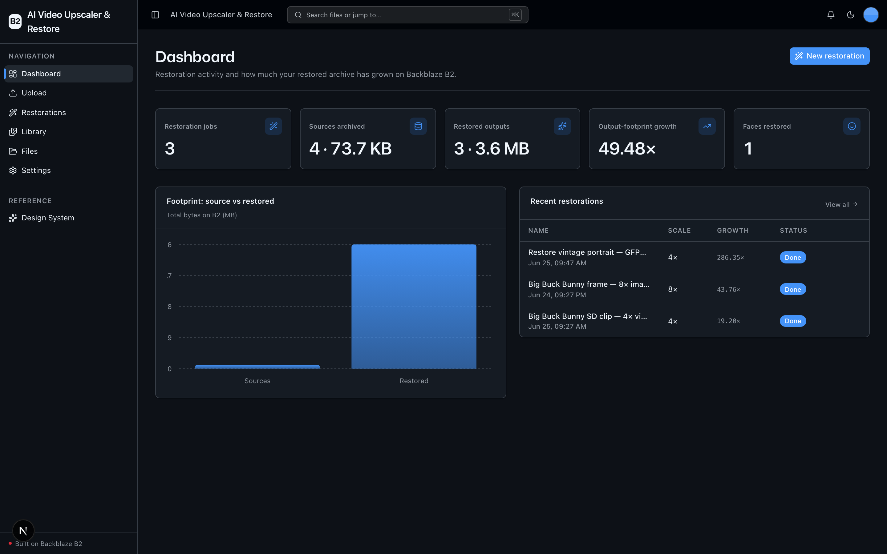
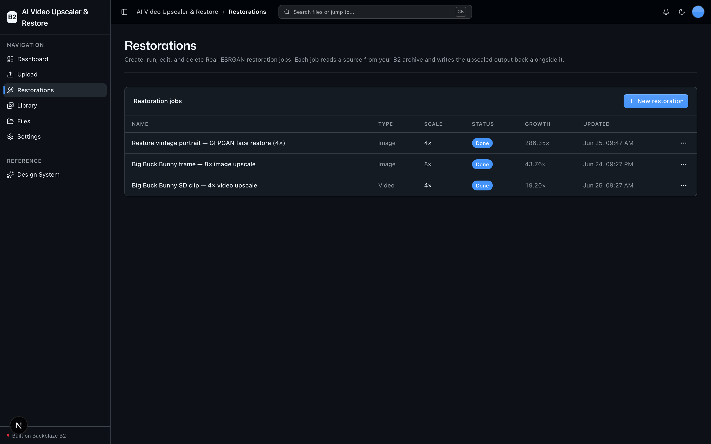
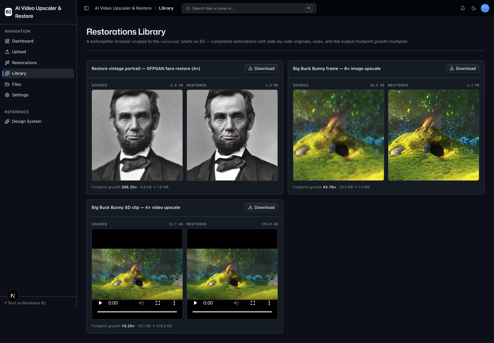
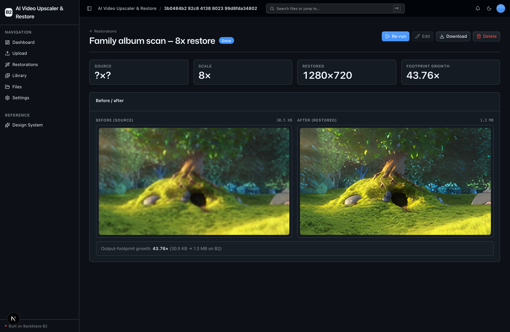

<!-- last_verified: 2026-06-24 -->
# AI Video Upscaler & Restore

Keep a permanent, self-hosted archive of both your *degraded originals* and your *AI-restored outputs* on **[Backblaze B2](https://www.backblaze.com/sign-up/ai-cloud-storage?utm_source=github&utm_medium=referral&utm_campaign=ai_artifacts&utm_content=b2ai-video-upscaler-restore)**. Upload low-resolution or degraded footage and images, create a **Restoration Job** that runs **Real-ESRGAN** 4×/8× super-resolution (with optional **GFPGAN** face restoration), and the larger restored output is written straight back to B2 alongside the source. A before/after browser reads both source and restored objects from B2 for side-by-side comparison and download.

Built for **archivists, content studios, and ML data teams**. Runs on **local OSS only** — Real-ESRGAN runs on your own machine, so the only credentials you need are your Backblaze B2 keys. No second API key.

**Why B2 is the point:** every restored clip writes back at 4×–8× the source resolution, so a 10 GB archive of SD footage can balloon to 40–80 GB of restored outputs. The app surfaces this **output-footprint growth** as its headline dashboard metric — a concrete picture of why durable, cheap object storage is the right home for an AI restoration pipeline. All B2 access is via the **S3-compatible API**, with a custom user-agent and the standardized `B2_*` env vars.

## What it looks like

**Dashboard** — restoration metrics, the source-vs-restored footprint chart, and the headline output-footprint growth multiplier over your B2 archive.



**Restorations** — the full Real-ESRGAN job list with type, scale, status, and growth, where jobs are created, run, edited, and deleted.



**Restorations Library** — a `restored/`-scoped before/after browser with side-by-side source vs restored, sizes, and the footprint-growth multiplier.



**Restoration detail** — a single job opened into an expanded before/after view with source/restored dimensions, scale, and the output-footprint growth.



## The workflow

1. **Ingest** — upload degraded source footage/images; they land in `uploads/` on B2.
2. **Extract** — for video, frames are pulled out with the bundled `imageio-ffmpeg` binary.
3. **Upscale** — Real-ESRGAN x4plus super-resolves each frame (4× or 8×); GFPGAN optionally restores faces.
4. **Store** — the restored image / reassembled mp4 is written to `restored/<job_id>/` on B2; the job manifest (`jobs/<job_id>.json`) is updated.
5. **Serve** — the before/after browser and detail view stream source and restored objects from B2 via short-lived presigned URLs.

## B2 object layout

```
uploads/<filename>                source archive (degraded/low-res images + short clips)
jobs/<job_id>.json                Restoration Job manifest — the system of record (no DB)
restored/<job_id>/output.<ext>    restored image or reassembled video
data/download_count.json          local download counter
```

Jobs are persisted as JSON manifests *in the bucket* — there is no database. The bucket is the single source of truth, which doubles down on the "B2 as the storage layer" story.

## Quick Start

You need: Node.js >= 20, pnpm >= 9, Python >= 3.11, and a free **[Backblaze B2 account](https://www.backblaze.com/sign-up/ai-cloud-storage?utm_source=github&utm_medium=referral&utm_campaign=ai_artifacts&utm_content=b2ai-video-upscaler-restore)**.

```bash
git clone https://github.com/backblaze-b2-samples/ai-video-upscaler-restore.git
cd ai-video-upscaler-restore
```

### 1. Install frontend dependencies

```bash
pnpm install
```

### 2. Set up the backend — two-step install

The base install is everything you need for the API, the UI, all B2 features, tests, and lint. The heavy ML stack is a **separate** install you only need when you actually want to **run** a restoration.

```bash
cd services/api
python -m venv .venv && source .venv/bin/activate

# Base — required. App, B2, tests, lint all work with just this.
pip install -r requirements.txt

# Engine — ONLY needed to actually RUN restorations (large download).
pip install -r requirements-restore.txt   # torch, realesrgan, gfpgan, ...

cd ../..
```

The engine is lazy-imported (see `app/repo/upscaler.py`), so the server starts, the test suite passes, and `pnpm build` works without the restore stack. If you try to run a restoration without it, you get a clear, actionable error pointing back at `requirements-restore.txt`.

> **Install gotcha (handled):** `basicsr` (pulled in by realesrgan/gfpgan) imports `torchvision.transforms.functional_tensor`, which was removed in torchvision ≥ 0.17. `requirements-restore.txt` pins a compatible torch/torchvision pair, and `app/repo/upscaler.py` also installs a tiny shim aliasing the old module path to `torchvision.transforms.functional` before importing the engine, so a newer torchvision still works.

### 3. Add your B2 credentials

```bash
cp .env.example .env
```

Open `.env` and fill in the standardized `B2_*` values. Head to the [Backblaze B2 dashboard](https://secure.backblaze.com/b2_buckets.htm?utm_source=github&utm_medium=referral&utm_campaign=ai_artifacts&utm_content=b2ai-video-upscaler-restore) and:

1. **Create a bucket.** Paste the bucket's **Unique Name** into `B2_BUCKET_NAME`, and the **region** from its endpoint (e.g. `us-west-004`) into `B2_REGION`. The app derives the S3 endpoint as `https://s3.<B2_REGION>.backblazeb2.com` — there is no separate endpoint variable.
2. **Create an application key** with `Read and Write` permission:
   - **keyID** → `B2_APPLICATION_KEY_ID`
   - **applicationKey** → `B2_APPLICATION_KEY` *(only shown once — paste it now)*

`B2_PUBLIC_URL_BASE` is optional; leave it blank for private buckets (the app serves objects via short-lived presigned URLs instead).

> Walkthroughs: [creating a bucket](https://www.backblaze.com/docs/cloud-storage-create-and-manage-buckets?utm_source=github&utm_medium=referral&utm_campaign=ai_artifacts&utm_content=b2ai-video-upscaler-restore) · [creating app keys](https://www.backblaze.com/docs/cloud-storage-create-and-manage-app-keys?utm_source=github&utm_medium=referral&utm_campaign=ai_artifacts&utm_content=b2ai-video-upscaler-restore).

### 4. Run it

```bash
pnpm dev
```

Frontend at `localhost:3000`, API at `localhost:8000`. `pnpm dev` runs `pnpm doctor` first — a preflight that catches the common setup gotchas (wrong Node/Python, missing venv, missing/placeholder `.env`, busy ports). Run it any time with `pnpm doctor`.

Ingest a source on **Upload**, create a job on **Restorations**, hit **Run**, and watch the before/after appear on the job detail and in the **Library**.

## Features

- [Restoration Jobs](docs/features/restoration-jobs.md) — the primary entity: create / read / edit / delete / run, all from the UI. Real-ESRGAN 4×/8× + optional GFPGAN, persisted as JSON manifests in B2.
- [Before/After Browser](docs/features/before-after-browser.md) — a `restored/`-scoped library with side-by-side source vs restored, sizes, and the growth multiplier.
- [Dashboard](docs/features/dashboard.md) — restoration metrics: jobs by status, sources vs restored footprint, and the headline output-footprint growth multiplier.
- [File Upload](docs/features/file-upload.md) — drag-and-drop ingest of the source archive into `uploads/`.
- [File Browser](docs/features/file-browser.md) — the full-bucket explorer (list, preview, download, delete).
- [Metadata Extraction](docs/features/metadata-extraction.md) — image dimensions, EXIF, checksums for source assets.
- [Design System](docs/design-system.md) — tokens, primitives, the blaze generating loader, inline `ErrorState` / `EmptyState`. Live preview at `/design`.
- Single-source config — one `.env` at the repo root powers both API and web, validated at startup so misconfig fails fast.
- Centralized data layer — every fetch flows through TanStack Query hooks in `apps/web/src/lib/queries.ts`.
- Structural tests, structured JSON logging, `/health`, `/metrics`.

## Tech Stack

- TypeScript, Next.js 16, React 19, Tailwind v4, shadcn/ui, Recharts
- TanStack Query — caching, dedup, retry for every fetch
- Python 3.11+, FastAPI, boto3, Pydantic v2, Pillow
- **Real-ESRGAN** (super-resolution), **GFPGAN** (face restoration), **imageio-ffmpeg** (bundled ffmpeg for video) — in `requirements-restore.txt`
- Backblaze B2 (S3-compatible object storage)
- pnpm workspaces (monorepo)

## Commands

| Command | What it does |
|---------|-------------|
| `pnpm dev` | Start frontend + backend |
| `pnpm dev:web` | Frontend only |
| `pnpm dev:api` | Backend only |
| `pnpm build` | Build frontend |
| `pnpm lint` | Lint frontend |
| `pnpm lint:api` | Lint backend (ruff) |
| `pnpm test:api` | Run backend tests (engine mocked — no ML stack needed) |
| `pnpm check:structure` | Verify layering rules |
| `pnpm test:e2e` | Playwright e2e tests (run `pnpm --filter @ai-video-upscaler-restore/web exec playwright install chromium` once first) |

## Documentation Map

| Doc | Purpose |
|-----|---------|
| [AGENTS.md](AGENTS.md) | Agent table of contents — start here |
| [ARCHITECTURE.md](ARCHITECTURE.md) | System layout, layering, restoration data flow |
| [docs/features/](docs/features/) | Feature docs (restoration jobs, before/after browser, dashboard, upload, browser, metadata) |
| [docs/app-workflows.md](docs/app-workflows.md) | User journeys |
| [docs/dev-workflows.md](docs/dev-workflows.md) | Engineering workflows and testing |
| [docs/SECURITY.md](docs/SECURITY.md) | Security principles + weights download note |
| [docs/RELIABILITY.md](docs/RELIABILITY.md) | Reliability expectations |
| [docs/exec-plans/](docs/exec-plans/) | Execution plans and tech debt tracker |

## License

MIT License - see [LICENSE](LICENSE) for details.

Example media in the screenshots (a public-domain 1863 portrait for the face
example; Big Buck Bunny, CC BY 3.0, for the upscale-only examples) is credited in
[docs/CREDITS.md](docs/CREDITS.md).

## Claude Agent B2 Skill

Manage Backblaze B2 from your terminal using natural language (list/search, audits, stale or large file detection, security checks, safe cleanup).

Repo: [https://github.com/backblaze-b2-samples/claude-skill-b2-cloud-storage](https://github.com/backblaze-b2-samples/claude-skill-b2-cloud-storage)
